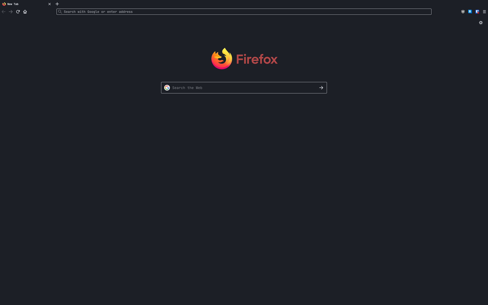
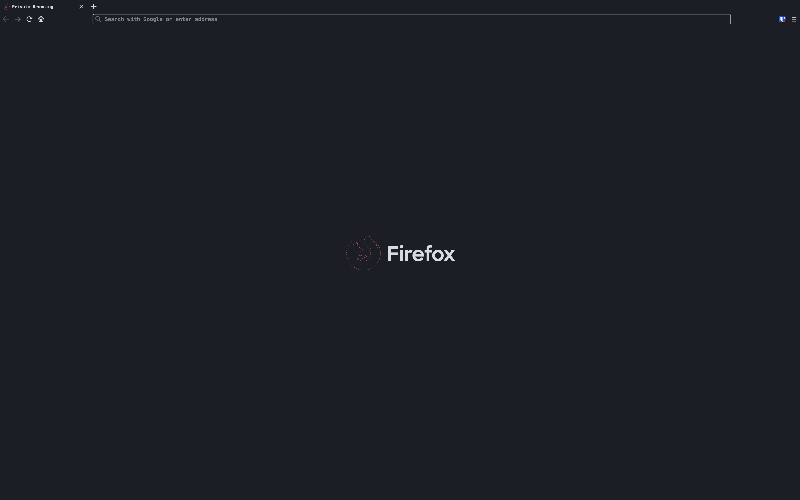

# Firefox-Horizon

This repsoitory contains the userContent.css and userChrome.css files for Firefox Horizon. Firefox Horizon is not managed by, created by, or in partnership with Mozilla, Firefox, or any of its affiliates. Horizon does not own any of the Firefox tradmarks, but rather justs acts as a free way to customize the browser.

### Description

Firefox custom theme. Forked from [Firefox-Halo](https://github.com/seirin-blu/Firefox-Halo). Inspired by [VS Code Horizon Theme](https://marketplace.visualstudio.com/items?itemName=jolaleye.horizon-theme-vscode).

### Normal Browsing Mode

### Private Browsing Mode

## Changelog

- Init. Forked from [Firefox-Halo](https://github.com/seirin-blu/Firefox-Halo).
- V1. Extract colors to variables for easy color switching. Add Font variable. Fix expanding search bar. Style right click menu.
